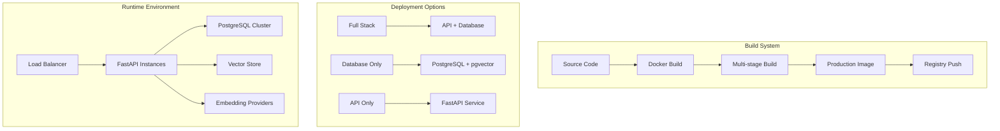

# Design Document

## Overview

This design document outlines the architecture and implementation approach for building and deploying a production-ready containerized version of the RAG (Retrieval-Augmented Generation) FastAPI service. The system provides document indexing and retrieval capabilities with vector database support, designed for scalable deployment across different environments.

The solution leverages Docker containerization with multi-stage builds, supports multiple deployment configurations, and includes comprehensive tooling for building, testing, and deploying the service to container registries.

## Architecture

### High-Level Architecture



### Container Architecture

The Docker architecture follows a multi-stage approach optimized for production deployment:

1. **Base Stage**: Python 3.10 runtime with system dependencies
2. **Dependencies Stage**: Python package installation and optimization
3. **Application Stage**: Application code and configuration
4. **Production Stage**: Minimal runtime image with security hardening

### Deployment Configurations

The system supports three primary deployment configurations:

1. **Full Stack Deployment**: Complete system with API service and PostgreSQL database
2. **Database-Only Deployment**: Standalone PostgreSQL with pgvector for external API connections
3. **API-Only Deployment**: Standalone API service connecting to external database

## Components and Interfaces

### Docker Build System

#### Multi-Stage Dockerfile
- **Base Image**: Python 3.10 slim for minimal attack surface
- **System Dependencies**: Pandoc, netcat, OpenGL libraries for document processing
- **Python Dependencies**: Optimized installation with pip caching
- **Security**: Non-root user execution and minimal permissions

#### Build Scripts
- **docker-build.sh**: Enhanced build script with multi-architecture support
- **docker-push.sh**: Registry push with authentication and error handling
- **Makefile**: Unified build commands and development workflows

### Configuration Management

#### Environment Variables
The system uses a comprehensive environment variable system for configuration:

```yaml
# Database Configuration
VECTOR_DB_TYPE: pgvector|atlas-mongo
POSTGRES_DB: Database name
POSTGRES_USER: Database user
POSTGRES_PASSWORD: Database password
DB_HOST: Database host
DB_PORT: Database port

# API Configuration
RAG_HOST: API bind address (default: 0.0.0.0)
RAG_PORT: API port (default: 8000)
DEBUG_RAG_API: Debug mode toggle

# Embedding Providers
EMBEDDINGS_PROVIDER: openai|azure|huggingface|ollama|bedrock|vertexai
EMBEDDINGS_MODEL: Model name for chosen provider
RAG_OPENAI_API_KEY: OpenAI API key
AZURE_OPENAI_ENDPOINT: Azure OpenAI endpoint
HF_TOKEN: HuggingFace token

# Processing Configuration
CHUNK_SIZE: Document chunk size (default: 1500)
CHUNK_OVERLAP: Chunk overlap (default: 100)
PDF_EXTRACT_IMAGES: Image extraction toggle
```

#### Configuration Validation
- Environment variable validation with type checking
- Default value provision for optional settings
- Configuration error reporting with clear messages

### Service Components

#### FastAPI Application
- **Async Architecture**: Full async/await implementation for scalability
- **Middleware Stack**: CORS, logging, security, and authentication middleware
- **Route Organization**: Modular route structure with clear separation of concerns
- **Error Handling**: Comprehensive error handling with structured responses

#### Vector Database Integration
- **PostgreSQL + pgvector**: Primary vector storage with async connection pooling
- **MongoDB Atlas**: Alternative vector storage for cloud deployments
- **Connection Management**: Automatic reconnection and health monitoring
- **Index Management**: Automatic vector index creation and optimization

#### Document Processing Pipeline
- **Multi-format Support**: PDF, DOCX, TXT, Markdown, and other formats
- **Text Chunking**: Configurable chunking with overlap for context preservation
- **Embedding Generation**: Multi-provider embedding support with rate limiting
- **Async Processing**: Thread pool execution for CPU-bound operations

### Deployment Infrastructure

#### Docker Compose Configurations

**Full Stack (docker-compose.yaml)**:
```yaml
services:
  db:
    image: ankane/pgvector:latest
    environment: [database config]
    volumes: [persistent storage]
    
  fastapi:
    build: .
    environment: [api config]
    depends_on: [db]
    volumes: [uploads, logs]
```

**Database Only (db-compose.yaml)**:
```yaml
services:
  db:
    image: ankane/pgvector:latest
    environment: [database config]
    volumes: [persistent storage]
    ports: [external access]
```

**API Only (api-compose.yaml)**:
```yaml
services:
  rag_api:
    build: .
    environment: [api config]
    volumes: [uploads, logs]
    ports: [external access]
```

## Data Models

### Document Storage Model
```python
class DocumentMetadata:
    file_id: str          # Unique file identifier
    user_id: str          # User/entity isolation
    filename: str         # Original filename
    content_type: str     # MIME type
    chunk_index: int      # Chunk sequence number
    total_chunks: int     # Total chunks in document
    created_at: datetime  # Creation timestamp
    updated_at: datetime  # Last update timestamp
```

### Vector Storage Schema
```sql
-- PostgreSQL with pgvector
CREATE TABLE document_embeddings (
    id SERIAL PRIMARY KEY,
    file_id VARCHAR(255) NOT NULL,
    user_id VARCHAR(255) NOT NULL,
    content TEXT NOT NULL,
    embedding VECTOR(1536),  -- OpenAI embedding dimension
    metadata JSONB,
    created_at TIMESTAMP DEFAULT NOW()
);

CREATE INDEX idx_file_id ON document_embeddings(file_id);
CREATE INDEX idx_user_id ON document_embeddings(user_id);
CREATE INDEX idx_embedding ON document_embeddings USING ivfflat (embedding vector_cosine_ops);
```

### Configuration Model
```python
class DeploymentConfig:
    vector_db_type: VectorDBType
    embeddings_provider: EmbeddingsProvider
    database_config: DatabaseConfig
    api_config: APIConfig
    security_config: SecurityConfig
```

## Error Handling

### Error Categories
1. **Configuration Errors**: Invalid environment variables, missing API keys
2. **Database Errors**: Connection failures, query timeouts, constraint violations
3. **Processing Errors**: Document parsing failures, embedding generation errors
4. **Authentication Errors**: Invalid tokens, authorization failures
5. **Resource Errors**: Memory limits, disk space, rate limiting

### Error Response Format
```json
{
    "error": {
        "code": "DOCUMENT_PROCESSING_FAILED",
        "message": "Failed to process document",
        "details": {
            "file_id": "abc123",
            "reason": "Unsupported file format",
            "timestamp": "2025-01-28T10:00:00Z"
        }
    }
}
```

### Recovery Strategies
- **Automatic Retry**: Transient failures with exponential backoff
- **Circuit Breaker**: Protection against cascading failures
- **Graceful Degradation**: Fallback to alternative providers
- **Health Monitoring**: Continuous health checks with alerting

## Testing Strategy

### Unit Testing
- **Service Layer Tests**: Database operations, vector store interactions
- **Utility Tests**: Document processing, configuration validation
- **Model Tests**: Pydantic model validation and serialization
- **Coverage Target**: 90% code coverage with critical path focus

### Integration Testing
- **Database Integration**: PostgreSQL and MongoDB vector operations
- **API Integration**: End-to-end request/response testing
- **Provider Integration**: Embedding provider connectivity testing
- **Container Testing**: Docker image functionality validation

### Performance Testing
- **Load Testing**: Concurrent request handling and throughput
- **Stress Testing**: Resource limits and failure modes
- **Embedding Performance**: Provider response times and rate limits
- **Database Performance**: Query optimization and index effectiveness

### Security Testing
- **Authentication Testing**: JWT validation and user isolation
- **Input Validation**: Malicious file upload prevention
- **Container Security**: Image vulnerability scanning
- **Network Security**: TLS configuration and port exposure

### Deployment Testing
- **Multi-Environment**: Development, staging, production validation
- **Configuration Testing**: Environment variable validation
- **Rollback Testing**: Deployment failure recovery procedures
- **Health Check Testing**: Readiness and liveness probe validation

## Security Considerations

### Container Security
- **Non-root Execution**: Application runs as non-privileged user
- **Minimal Base Image**: Reduced attack surface with slim images
- **Dependency Scanning**: Regular vulnerability assessment
- **Secret Management**: Environment-based secret injection

### API Security
- **JWT Authentication**: Token-based authentication with expiration
- **User Isolation**: Document access restricted by user_id
- **Input Validation**: Comprehensive request validation
- **Rate Limiting**: Protection against abuse and DoS attacks

### Database Security
- **Connection Encryption**: TLS-encrypted database connections
- **Access Control**: Database user with minimal required permissions
- **Query Parameterization**: SQL injection prevention
- **Audit Logging**: Database operation logging for compliance

### Network Security
- **Internal Communication**: Service-to-service communication over private networks
- **Port Exposure**: Minimal external port exposure
- **TLS Termination**: HTTPS enforcement at load balancer level
- **Firewall Rules**: Network-level access control

## Monitoring and Observability

### Logging Strategy
- **Structured Logging**: JSON-formatted logs for parsing
- **Log Levels**: Appropriate log levels for different environments
- **Request Tracing**: Request ID tracking across services
- **Error Aggregation**: Centralized error collection and alerting

### Metrics Collection
- **Application Metrics**: Request rates, response times, error rates
- **System Metrics**: CPU, memory, disk usage
- **Database Metrics**: Connection pool usage, query performance
- **Business Metrics**: Document processing rates, user activity

### Health Monitoring
- **Health Endpoints**: /health and /ready endpoints for orchestration
- **Database Health**: Connection and query health checks
- **Provider Health**: Embedding provider availability checks
- **Resource Health**: Memory and disk usage monitoring

## Deployment Strategy

### Build Pipeline
1. **Source Control**: Git-based version control with branching strategy
2. **Automated Testing**: CI pipeline with comprehensive test suite
3. **Image Building**: Multi-architecture Docker image creation
4. **Security Scanning**: Container and dependency vulnerability scanning
5. **Registry Push**: Authenticated push to container registry
6. **Deployment Trigger**: Automated deployment to target environments

### Environment Strategy
- **Development**: Local development with docker-compose
- **Staging**: Production-like environment for integration testing
- **Production**: High-availability deployment with monitoring
- **Disaster Recovery**: Backup and restore procedures

### Scaling Strategy
- **Horizontal Scaling**: Multiple API service instances behind load balancer
- **Database Scaling**: Read replicas and connection pooling
- **Resource Scaling**: CPU and memory scaling based on load
- **Storage Scaling**: Persistent volume expansion for document storage